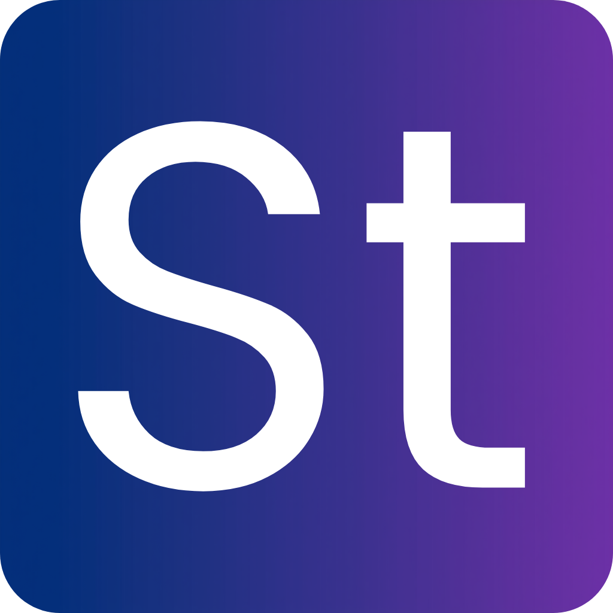

# LinguaTone – Sinhala ↔ English Tone Converter



**Translate. Refine. Sound Natural.**

LinguaTone is a **mobile-first AI-powered web app** built with **Next.js**, designed to convert text between **Sinhala and English** while adjusting the tone to **formal, casual, or corporate styles**. It's fully **free**, serverless, and deployable on **Vercel**.

---

## 🚀 Features

- 🔄 **Sinhala ↔ English translation**
- 🎯 **Tone transformation**: Formal, Casual, Corporate
- ⚡ **Fast serverless AI responses**
- 📱 **Mobile-first, responsive UI**
- 🪶 Minimal, clean interface with **glassmorphism design**
- 🔄 Copy & Clear buttons for easy usage
- 🌟 Language detection badge (auto detects Sinhala or English)
- 🕹️ Loading animations for premium UX

---

## 🛠 Tech Stack

- **Next.js (App Router)**
- **TypeScript**
- **Tailwind CSS**
- **OpenRouter / Arcee AI Trinity Mini** for AI processing
- **Vercel** for serverless deployment

---

## 💡 How It Works

1. **Input text** in Sinhala or English.
2. **Select tone** from Formal, Casual, or Corporate.
3. **Press Convert** – AI translates and rewrites your text.
4. **Copy or reuse** the output for emails, documents, or social media.

> Example:
>
> Input: `"Send me the file today"`  
> Tone: `Corporate`  
> Output (Sinhala): `"කරුණාකර අද දින ඇතුළත අදාල ගොනුව එවීමට කටයුතු කරන්න."`

---

## 🎨 UI / UX Highlights

- Gradient app icon (Indigo → Purple) with “LT” monogram
- Glassmorphism cards for input/output
- Loading spinner + skeleton animation for smooth feedback
- Fully mobile-optimized layout

---

## ⚡ Deployment

1. Clone the repo:

```bash
git clone https://github.com/yourusername/linguatone.git
cd linguatone
```
